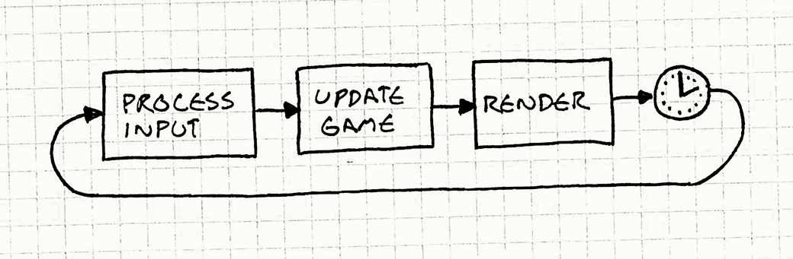
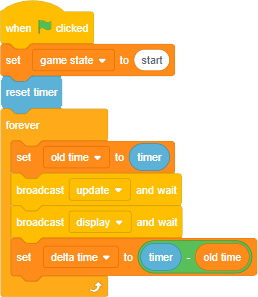

# Game Loop


## 1. Simple GameLoop


```cpp
while (true)
{
  double start = getCurrentTime();
  processInput();
  update();
  render();

  sleep(start + MS_PER_FRAME - getCurrentTime());
  //The sleep() here makes sure the game doesn’t run too fast if it processes a frame quickly
}
```

## 2. Game loop: scratch


## 3. Unity Monobehavior life cycle


